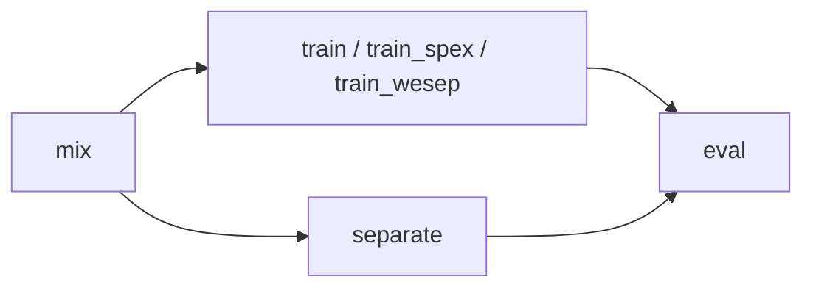

# 架构说明

## 路径模型

| 概念 | 默认 | 说明 |
|------|------|------|
| **project_root** | 仓库根目录 | checkpoints、outputs、代码 |
| **work_root** | `./data` | 原始语料、混合数据、downloads |

配置见 `configs/experiment_config.json`；CLI 可用 `--work-root`、`--project-root` 覆盖。

## 流水线阶段

| Stage | 模块 | 产出 |
|-------|------|------|
| `mix` | `mixtures.py`, `dataset.py` | `work_root/processed/mixtures/`, `speaker_splits.json` |
| `train` | `model.py`, `train.py` | `checkpoints/attention_tse/` |
| `train_spex` | `spex.py`, `spex_train.py` | `checkpoints/spex_plus/` |
| `train_wesep` | `wesep_finetune.py` | `checkpoints/wesep_bsrnn_ft/` |
| `separate` | `separation.py` | `outputs/separated/mossformer2/` |
| `eval` | `pretrained_tse.py`, `pipeline.py` | 5 路 wav + `metrics_*.csv` |

编排入口：`cocktail_party/pipeline.py`；CLI：`run.py`。

## 模块职责

| 模块 | 职责 |
|------|------|
| `config.py` | `ExperimentConfig` 解析与路径解析 |
| `mixtures.py` | 多说话人混合 + MUSAN 噪声 |
| `dataset.py` | speaker-disjoint 划分、DataLoader |
| `model.py` + `train.py` | 自研 AttentionTSE |
| `spex.py` + `spex_train.py` | SpEx+ 自训练对照 |
| `pretrained_tse.py` | WeSep 预训练/微调推理 |
| `wesep_finetune.py` | WeSep BSRNN 域内 SI-SDR 微调 |
| `separation.py` | MossFormer2 盲分离（Oracle 上界） |
| `selection.py` | ECAPA 说话人嵌入（训练用） |
| `metrics.py` | SI-SDR 等指标 |
| `pipeline.py` | 阶段编排、`metrics_all` 合并 |
| `audio.py` / `io.py` | 读写 wav、工具函数 |

## 5 路对比方案

`eval` 阶段在测试集上依次推理并写 CSV：

1. AttentionTSE（自研，塌缩案例）
2. SpEx+ 自训练
3. WeSep-BSRNN 预训练
4. WeSep-BSRNN 微调（**成功方案**）
5. Oracle + MossFormer2（上界）

## 相关文档

- 实验结论与数值 → [experiment_report.md](experiment_report.md)
- 产物路径索引 → [outputs_index.md](outputs_index.md)
- 权重下载 → [checkpoints.md](checkpoints.md)
