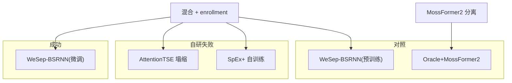

# 鸡尾酒会目标说话人提取实验报告

**项目**：Cocktail Party — 方案 B 目标说话人提取对比  
**日期**：2026-06  
**project_root**：仓库根目录（checkpoints、outputs）  
**work_root**：`./data`（原始语料与混合数据，可指向外部路径）

---

## 摘要

本实验在自建 16 kHz 中英鸡尾酒会混合数据（12000 条，测试集 1792 条）上，系统对比了自研 AttentionTSE、自训练 SpEx+、WeSep 预训练/微调 TSE 及 Oracle 上界。**最终成功方案为 WeSep BSRNN+ECAPA 域内微调**：测试集整体 **ΔSI-SDR +11.63 dB**，**2 说话人条件 +13.58 dB**（实验成功标志，目标 ~10 dB）。零样本 WeSep 预训练 +5.32 dB；自研两条路线因训练塌缩或欠训练失败；历史 ClearerVoice 8 kHz SpEx+ 预训练因域不匹配为 -7.9 dB 已弃用。

---

## 1. 任务与评测协议

### 1.1 任务定义

给定混合语音 `mixture` 与目标说话人参考音 `enrollment`，估计目标说话人单路波形 `estimate`，与真实目标源 `target` 比较。

### 1.2 指标

- **SI-SDR_in**：混合音相对目标的 SI-SDR（通常为负，越难分离越负）
- **SI-SDR_out**：估计音相对目标的 SI-SDR
- **ΔSI-SDR** = out − in（主对比指标，越大越好）

分组维度：`condition`（clean / 5 / 0 / -5 dB）× `n_speakers`（2 / 3 / 4）。

### 1.3 数据划分

按 `target_speaker` **speaker-disjoint** 划分（约 70% / 15% / 15%），避免测试说话人泄漏到训练集。划分见 `outputs/speaker_splits.json`。

| 划分 | 样本数 | 说话人数 |
|------|--------|----------|
| train | 8488 | 473 |
| val | 1720 | 101 |
| test | **1792** | 103 |

---

## 2. 数据集

| 项 | 配置 |
|----|------|
| 总混合数 | 12000 |
| 时长 | 5–10 s |
| 采样率 | 16 kHz |
| 说话人数/条 | 2 / 3 / 4（各 4000） |
| SNR | clean、5、0、-5 dB（各 3000） |
| 干净语料 | LibriSpeech、THCHS30、AISHELL train、DIY |
| 噪声 | MUSAN |
| enrollment | 目标说话人 5 s 参考段 |

---

## 3. 对比方案

最终保留 **5 条**（已从 pipeline 移除 ECAPA+MossFormer2 选路基线）：



| 模型 | 类型 | 条件输入 | 说明 |
|------|------|----------|------|
| **WeSep-BSRNN(微调)** | 预训练+域内微调 | enrollment 波形→fbank | **主结果** |
| WeSep-BSRNN(预训练) | 零样本 | enrollment 波形 | VoxCeleb1 预训练 |
| Oracle+MossFormer2 | 上界 | 已知源索引 | MossFormer2 分离后取真源 |
| AttentionTSE | 自研 | ECAPA 嵌入 | 掩码网络，塌缩 |
| SpEx+ 自训练 | 自研 | ECAPA 嵌入 | 端到端，欠训练 |

---

## 4. 方法细节

### 4.1 WeSep BSRNN+ECAPA（成功方案）

**预训练**：WeSep `bsrnn_ecapa_vox1`，BSRNN 频带分离 + 冻结 ECAPA_TDNN 说话人编码，VoxCeleb1 2 说话人混合训练，16 kHz。

**域内微调**（`cocktail_party/wesep_finetune.py`）：

- 初始化：`checkpoints/wesep_bsrnn/avg_model.pt`
- 冻结：`spk_model`（ECAPA）
- 训练：`BN` / `separator` / `mask`
- 损失：SI-SDR（`si_sdr_loss`）
- 数据：`CocktailDataset`，4 s 随机裁剪，train 8488 条
- enrollment：kaldi fbank，80 mel，cmn
- 优化：Adam lr=1e-4，batch=4，最多 15 epoch，早停 patience=5

**训练曲线**（`outputs/run_train_wesep.log`）：

| Epoch | train_loss | val_si_sdr (crop) | val_rms |
|-------|------------|-------------------|---------|
| 1 | 1.771 | 3.775 | 0.0129 |
| 2 | 0.287 | 4.081 | 0.0124 |
| 3 | -0.499 | 4.352 | 0.0136 |
| 4 | -1.243 | **4.529** | 0.0124 |

best checkpoint：`checkpoints/wesep_bsrnn_ft/best.pt`（epoch 4）。

### 4.2 WeSep 预训练（零样本对照）

同架构，不微调，直接 `wesep.cli.extractor.load_model_local`，VAD 关闭。曾尝试 ClearerVoice SpEx+（8 kHz WSJ0）得 **-7.9 dB**，证伪后弃用。

### 4.3 Oracle+MossFormer2

`MossFormer2_SS_16K` 盲分离后，按 metadata 中目标源索引选取对应 stem，作为 TSE 上界（非 enrollment 驱动）。

### 4.4 AttentionTSE（失败：静音塌缩）

STFT 掩码 + ECAPA FiLM + Cross-Attention。训练中出现 **输出 RMS→0**，`si_sdr_out≈0` 但 `delta_si_sdr` 虚高（因 in 为负）。根因：SI-SDR 对全零输出存在低 loss 吸引子。详见历史章节；**不可用于性能对比**。

### 4.5 SpEx+ 自训练（失败：欠训练）

简化 SpEx+ + ECAPA 条件，lr=5e-5。epoch 2 存 best 后 epoch 4 起验证塌缩；测试用 epoch 2，输出非静音但 **ΔSI-SDR 仅 +0.83 dB**。

---

## 5. 实验结果

### 5.1 测试集整体（1792 条）

| 模型 | mean ΔSI-SDR (dB) | mean SI-SDR_out (dB) | mean SI-SDR_in (dB) |
|------|-------------------|----------------------|---------------------|
| **WeSep-BSRNN(微调)** | **+11.630** | **+5.451** | -6.179 |
| WeSep-BSRNN(预训练) | +5.320 | -0.860 | -6.179 |
| Oracle+MossFormer2 | +6.542 | +0.363 | -6.179 |
| SpEx+ 自训练 | +0.830 | -5.349 | -6.179 |
| AttentionTSE（塌缩） | +6.164 * | -0.015 | -6.179 |

\* 假象，见 5.3 节。

### 5.2 头条指标：2 说话人 mean ΔSI-SDR

| 模型 | 2spk 均值 (dB) |
|------|----------------|
| **WeSep-BSRNN(微调)** | **+13.584** |
| WeSep-BSRNN(预训练) | +8.527 |
| Oracle+MossFormer2 | +10.497 |
| SpEx+ 自训练 | +0.920 |
| AttentionTSE | +4.026（假象） |

**WeSep 微调 — 2 说话人分 SNR**：

| condition | ΔSI-SDR (dB) |
|-----------|--------------|
| clean | 12.954 |
| 5 dB | 12.299 |
| 0 dB | 12.800 |
| -5 dB | 16.284 |

### 5.3 分组对比（mean ΔSI-SDR，dB）

| condition | n_spk | WeSep FT | WeSep PT | Oracle | SpEx+ | AttnTSE* |
|-----------|-------|----------|----------|--------|-------|----------|
| clean | 2 | **12.95** | 12.90 | 9.57 | 0.12 | 0.22 |
| clean | 3 | 11.02 | 5.18 | 2.27 | 0.07 | 3.35 |
| clean | 4 | 8.76 | 3.44 | 1.21 | 0.11 | 5.20 |
| 5 dB | 2 | **12.30** | 8.01 | 8.86 | 0.32 | 2.17 |
| 0 dB | 2 | **12.80** | 6.15 | 10.57 | 1.14 | 4.83 |
| -5 dB | 2 | **16.28** | 7.05 | 12.98 | 2.10 | 8.89 |

微调后在多数格点优于预训练与 Oracle；3–4 说话人仍更难，但微调整体仍为正增益。

### 5.4 预训练 vs 微调增益

域内 4 epoch 微调将整体 ΔSI-SDR 从 **+5.32** 提升至 **+11.63**（+6.3 dB）；SI-SDR_out 从 -0.86 提升至 **+5.45**，说明不仅相对混合有增益，绝对重建质量也达可用水平。

---

## 6. 讨论

### 6.1 为何预训练 SpEx+ 失败而 WeSep 可行？

| 因素 | ClearerVoice SpEx+ | WeSep BSRNN |
|------|-------------------|-------------|
| 采样率 | 8 kHz | 16 kHz |
| 训练域 | WSJ0 英文 2mix | VoxCeleb1 |
| 条件 | 辅助波形 | ECAPA+BSRNN |
| 零样本 Δ | **-7.9 dB** | **+5.3 dB** |

### 6.2 为何需要微调？

WeSep 预训练面向 VoxCeleb 2 说话人场景；本数据含 3–4 说话人、中英、多 SNR。微调后 3–4 说话人增益明显（如 4spk clean：3.44→8.76 dB）。

### 6.3 自研路线教训

1. **指标假象**：塌缩时 ΔSI-SDR 可能虚高，必须检查 `si_sdr_out` 与 wav RMS。
2. **损失设计**：避免静音/零掩码成为吸引子。
3. **成熟骨干**：直接微调 WeSep 比从零训 AttentionTSE/SpEx+ 更省时而有效。

### 6.4 历史方案 ECAPA+MossFormer2

两阶段基线曾达 **+4.12 dB**，为可信工程参考，但已从最终 5 路表中移除以突出「WeSep 成功 + 自研失败」叙事；ECAPA 编码器仍用于自研模型训练。

---

## 7. 结论

1. **实验成功标志达成**：WeSep-BSRNN 域内微调，2 说话人 **ΔSI-SDR +13.58 dB**（>10 dB 目标），整体 **+11.63 dB**，优于 Oracle（+6.54 dB）与零样本 WeSep（+5.32 dB）。
2. **推荐交付路径**：`wesep_bsrnn` 预训练 + 本项目数据上 SI-SDR 微调 → `wesep_bsrnn_ft/best.pt`。
3. **自研 AttentionTSE / SpEx+** 保留为失败对照，不宜上线。
4. **零样本** 可用 WeSep 预训练（+5.3 dB），但微调收益显著。

---

## 8. 复现

```bash
conda activate cocktail
cd <project_root>

# 微调（约 1h/epoch × 4 epoch on RTX 3090）
python run.py train_wesep --work-root ./data

# 5 路评测（含推理 + 指标 + 合并 metrics_all）
python run.py separate --work-root ./data   # Oracle 需要
python run.py eval --work-root ./data
```

依赖与权重见 [checkpoints.md](checkpoints.md)。

---

## 9. 产物索引

完整路径、CSV 字段、日志列表见 **[outputs_index.md](outputs_index.md)**。  
后续 AI 会话请先读 **[ai_context.md](ai_context.md)**。

---

## 附录 A：流水线阶段

| 阶段 | 命令 | 产出 |
|------|------|------|
| mix | `run.py mix` | metadata, speaker_splits |
| train | `run.py train` | attention_tse/best.pt |
| train_spex | `run.py train_spex` | spex_plus/best.pt |
| **train_wesep** | `run.py train_wesep` | **wesep_bsrnn_ft/best.pt** |
| separate | `run.py separate` | separated/mossformer2 |
| eval | `run.py eval` | metrics_*, target_extracted/* |

## 附录 B：已清理产物

- `checkpoints/clearvoice_spex/`、`target_extracted/pretrained_spex/`、`.vendor/clearvoice_tse/`
- `metrics_tse_ecapa_*`、`target_extracted/ecapa_mossformer2/`
- `target_extracted/attention_tse/` wav（指标 CSV 保留）
